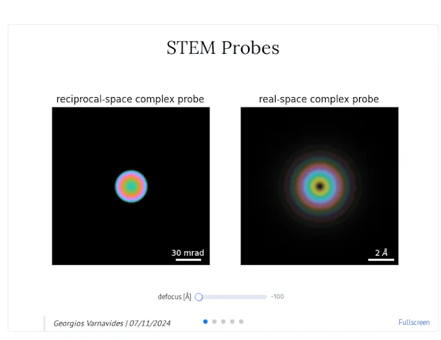
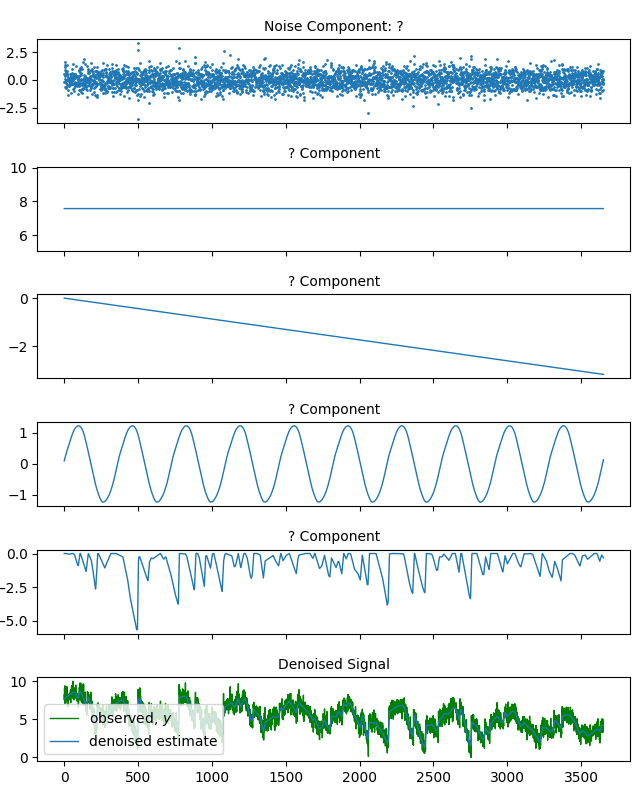
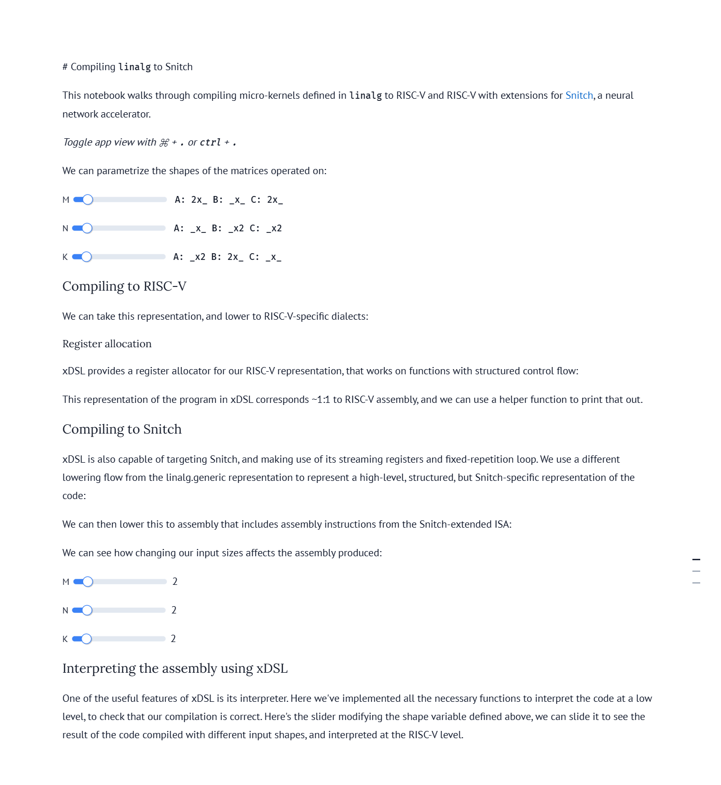

# Spotlights! 🌟

We feature a project or marimo notebook from the community every Thursday!

Have a project that you'd like us to spotlight? Feel free to open an issue.

## Running example notebooks

The example notebooks in this repo have their package dependencies inlined.
If you have [`uv`](https://github.com/astral-sh/uv) installed, you can open a
notebook with

```shell
uvx marimo edit --sandbox notebook.py
```

and marimo will automatically install its dependencies in an isolated
virtual environment.

## Spotlights! 🌟

We feature a project or marimo notebook from the community every Thursday!

Have a project that you'd like us to spotlight? Feel free to open an [issue](https://github.com/marimo-team/spotlights/issues).

## Running example notebooks

The example notebooks in this repo have their package dependencies inlined.
If you have [`uv`](https://github.com/astral-sh/uv) installed, you can open a
notebook with

```shell
uvx marimo edit --sandbox notebook.py
```

and marimo will automatically install its dependencies in an isolated
virtual environment.

## Examples

<table border="0">
  <tr>
    <td>
      <a target="_blank" href="https://x.com/trevmanz/status/1818664678609858802">
        
      </a>
    </td>
    <td>
      <a target="_blank" href="https://marimo.io/p/@gvarnavides/stem-probes">
        
      </a>
    </td>
    <td>
      <a target="_blank" href="https://signal-decomp-tutorial.org/">
        
      </a>
    </td>
    <td>
      <a target="_blank" href="https://xdsl.dev/index">
        
      </a>
    </td>
  </tr>
  <tr>
    <td>
      <a href="001-anywidget/">anywidget</a>
    </td>
    <td>
      <a href="002-stem-probes/">Georgios Varnavides</a>
    </td>
    <td>
      <a href="003-bennet-meyers/">Bennet Meyers</a>
    </td>
    <td>
      <a href="004-xdsl/">xDSL</a>
    </td>
  </tr>
  <tr>
    <td>
      <a target="_blank" href="https://marimo.io/p/@anywidget/demo">
        
      </a>
    </td>
    <td>
      <a target="_blank" href="https://marimo.io/p/@gvarnavides/stem-probes">
        
      </a>
    </td>
    <td>
      <a target="_blank" href="https://marimo.io/@public/signal-decomposition">
        
      </a>
    </td>
    <td>
      <a target="_blank" href="https://marimo.io/@haleshot/notebook-3juvpw">
        
      </a>
    </td>
  </tr>
</table>

1. [anywidget](001-anywidget/) is a Python library for making interoperable
   widgets; use anywidget to make custom UI elements for marimo.
2. [Georgios Varnavides](002-stem-probes/): Miller Fellow at UC Berkeley who uses marimo's WebAssembly features to create interactive science content.
3. [Bennet Meyers](003-bennet-meyers/) Bennet Meyers is a staff scientist
   at SLAC who has been a supporter of marimo since day one; he made and
   deployed the first ever marimo notebook, an interactive tutorial
   that teaches how to use signal decomposition.
4. [xDSL](004-xdsl/) xDSL is a Python-native compiler toolkit that lowers the barrier to entry for developing DSLs. It's closely connected to the MLIR/LLVM projects and aims to enable exascale computing. xDSL uses marimo to create interactive documentation with embedded playground notebooks.
