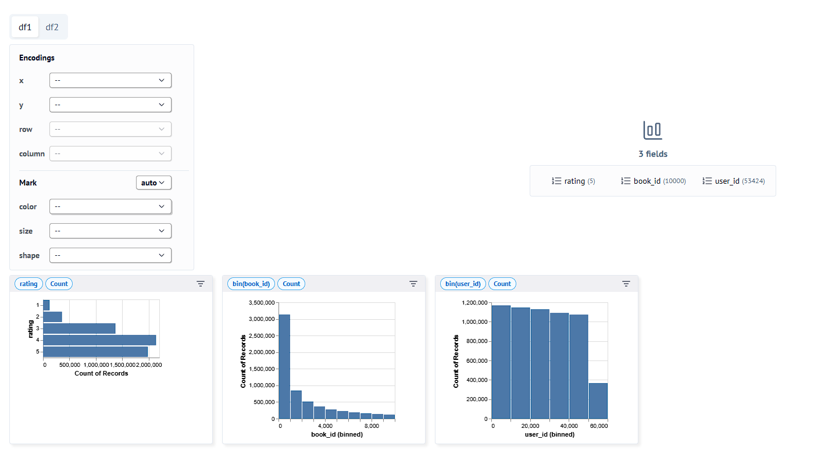

# Spotlights! 🌟

We feature a project or marimo notebook from the community every Thursday!

Have a project that you'd like us to spotlight? Feel free to open an [issue](https://github.com/marimo-team/spotlights/issues).

## Running example notebooks

The example notebooks in this repo have their package dependencies inlined.
If you have [`uv`](https://github.com/astral-sh/uv) installed, you can open a
notebook with

```shell
uvx marimo run --sandbox notebook.py
```

and marimo will automatically install its dependencies in an [isolated
virtual environment](https://marimo.io/blog/sandboxed-notebooks).

To edit the notebook source code, replace `run` with `edit` in the above commands.

## Examples

<details open>
<summary><h3>April 2025</h3></summary>

<table border="0">
  <tr>
    <td width="50%">
      <a target="_blank" href="https://www.linkedin.com/posts/marimo-io_kafka-sql-activity-7316208137596780544-YuJi?utm_source=share&utm_medium=member_desktop&rcm=ACoAADSJzvgBkjBd85IWDyUWA6ttzq8B-NDq-Hs">
        
      </a>
    </td>
    <td width="50%">
      <a target="_blank" href="https://smoh.github.io/akatsuki-tutorial/live">
        
      </a>
    </td>
  </tr>
  <tr>
    <td>
      <a href="18_Jove/">Jove</a>
    </td>
    <td>
      <a href="019-smohspace/">Semyeong</a>
    </td>
  </tr>
  <tr>
    <td>
      <a target="_blank" href="https://github.com/timeplus-io/proton/blob/develop/examples/marimo/github.py">
        
      </a>
    </td>
    <td>
      <a target="_blank" href="https://smoh.github.io/akatsuki-tutorial/live">
        
      </a>
    </td>
  </tr>
</table>
</details>

<details>
<summary><h3>March 2025</h3></summary>

<table border="0">
  <tr>
    <td width="100%">
      <a target="_blank" href="https://github.com/arthrod/prompting">
        
      </a>
    </td>
  </tr>
  <tr>
    <td>
      <a href="017-arthur/">Arthur S.</a>
    </td>
  </tr>
  <tr>
    <td>
      <a target="_blank" href="https://github.com/arthrod/prompting">
        
      </a>
    </td>
  </tr>
</table>
</details>

<details>
<summary><h3>February 2025</h3></summary>

<table border="0">
  <tr>
    <td width="50%">
      <a target="_blank" href="https://github.com/tschm/cradle">
        
      </a>
    </td>
    <td width="50%">
      <a target="_blank" href="https://towardsdatascience.com/publish-interactive-data-visualizations-for-free-with-python-and-marimo/">
        
      </a>
    </td>
  </tr>
  <tr>
    <td>
      <a href="015-cradle/">cradle</a>
    </td>
    <td>
      <a href="016-sam-minot/">Sam Minot</a>
    </td>
  </tr>
  <tr>
    <td>
      <a target="_blank" href="https://github.com/tschm/cradle">
        
      </a>
    </td>
    <td>
      <a target="_blank" href="https://fredhutch.github.io/marimo-publication/">
        
      </a>
    </td>
  </tr>
</table>
</details>

<details>
<summary><h3>January 2025</h3></summary>

<table border="0">
  <tr>
    <td width="50%">
      <a target="_blank" href="https://rparkr.github.io/polars-intro/">
        
      </a>
    </td>
    <td width="50%">
      <a target="_blank" href="https://paulkarayan.com/blog/marimo-cli-gui-notebook-and-microapps/">
        
      </a>
    </td>
  </tr>
  <tr>
    <td>
      <a href="014-ryan-parker/">Ryan Parker</a>
    </td>
    <td>
      <a href="013-paul-karayan/">Paul Karayan</a>
    </td>
  </tr>
  <tr>
    <td>
      <a target="_blank" href="https://rparkr.github.io/polars-intro/">
        
      </a>
    </td>
    <td>
      <a target="_blank" href="https://paulkarayan.com/blog/marimo-cli-gui-notebook-and-microapps/">
        
      </a>
    </td>
  </tr>
</table>
</details>

<details>
<summary><h3>December 2024</h3></summary>

<table border="0">
  <tr>
    <td width="100%">
      <a target="_blank" href="https://github.com/metaboulie/marimo-themes">
        
      </a>
    </td>
  </tr>
  <tr>
    <td>
      <a href="012-eugene/">Eugene</a>
    </td>
  </tr>
  <tr>
    <td>
      <a target="_blank" href="https://github.com/metaboulie/marimo-themes/tree/main/tests">
        
      </a>
    </td>
  </tr>
</table>

</details>

<details>
<summary><h3>November 2024</h3></summary>

<table border="0">
  <tr>
    <td width="100%">
      <a target="_blank" href="https://marimo.io/p/@marimo/interactive-matrices">
        
      </a>
    </td>
  </tr>
  <tr>
    <td>
      <a href="011-Vincent/">Vincent Warmerdam</a>
    </td>
  </tr>
  <tr>
    <td>
      <a target="_blank" href="https://marimo.io/p/@marimo/interactive-matrices">
        
      </a>
    </td>
  </tr>
</table>

</details>

<details>
<summary><h3>October 2024</h3></summary>

<table border="0">
  <tr>
    <td width="50%">
      <a target="_blank" href="https://lvof.we3lab.tech/">
        
      </a>
    </td>
    <td width="50%">
      <a target="_blank" href="https://marimo.io/p/@muhammad-mustjaab/analysis-of-wait-times-in-canadian-hospitals-critical-procedures">
        
      </a>
    </td>
  </tr>
  <tr>
    <td>
      <a href="009-WE3-Lab/">Stanford WE3 Lab</a>
    </td>
    <td>
      <a href="010-Mustjaab/">Mustjaab</a>
    </td>
  </tr>
  <tr>
    <td>
      <a target="_blank" href="https://lvof.we3lab.tech/">
        
      </a>
    </td>
    <td>
      <a target="_blank" href="https://marimo.io/p/@muhammad-mustjaab/analysis-of-wait-times-in-canadian-hospitals-critical-procedures">
        
      </a>
    </td>
  </tr>
</table>

</details>

<details>
<summary><h3>September 2024</h3></summary>

<table border="0">
  <tr>
    <td width="25%">
      <a target="_blank" href="https://cvxgrp.org/nasa/">
        
      </a>
    </td>
    <td width="25%">
      <a target="_blank" href="https://github.com/vrtnis/marimo-cheat-sheet">
        
      </a>
    </td>
    <td width="25%">
      <a target="_blank" href="https://github.com/Haleshot/Goodreads-Dataset-EDA">
        
      </a>
    </td>
    <td width="25%">
      <a target="_blank" href="https://github.com/Haleshot/marimo-tutorials">
        
      </a>
    </td>
  </tr>
  <tr>
    <td>
      <a href="005-cvxpy-nasa/">NASA CVXPY</a>
    </td>
    <td>
      <a href="006-vrtnis/">vrtnis</a>
    </td>
    <td>
      <a href="007-haleshot/">Haleshot</a>
    </td>
    <td>
      <a href="008-marimo-tutorials/">marimo-tutorials</a>
    </td>
  </tr>
  <tr>
    <td>
      <a target="_blank" href="https://marimo.io/c/@convex-optimization-nasa/convex-optimization-short-course-nasa">
        
      </a>
    </td>
    <td>
      <a target="_blank" href="https://marimo.io/p/@spotlights/006-vrtnis">
        
      </a>
    </td>
    <td>
      <a target="_blank" href="https://marimo.io/p/@haleshot/goodreads-dataset-eda">
        
      </a>
    </td>
    <td>
      <a target="_blank" href="https://marimo.io/c/@haleshot/marimo-tutorials">
        
      </a>
    </td>
  </tr>
</table>

</details>

<details>
<summary><h3>August 2024</h3></summary>

<table border="0">
  <tr>
    <td width="25%">
      <a target="_blank" href="https://x.com/trevmanz/status/1818664678609858802">
        
      </a>
    </td>
    <td width="25%">
      <a target="_blank" href="https://marimo.io/p/@gvarnavides/stem-probes">
        
      </a>
    </td>
    <td width="25%">
      <a target="_blank" href="https://signal-decomp-tutorial.org/">
        
      </a>
    </td>
    <td width="25%">
      <a target="_blank" href="https://xdsl.dev/index">
        
      </a>
    </td>
  </tr>
  <tr>
    <td>
      <a href="001-anywidget/">anywidget</a>
    </td>
    <td>
      <a href="002-stem-probes/">Georgios Varnavides</a>
    </td>
    <td>
      <a href="003-bennet-meyers/">Bennet Meyers</a>
    </td>
    <td>
      <a href="004-xdsl/">xDSL</a>
    </td>
  </tr>
  <tr>
    <td>
      <a target="_blank" href="https://marimo.io/p/@spotlights/001-anywidgets-trevor-manz">
        
      </a>
    </td>
    <td>
      <a target="_blank" href="https://marimo.io/p/@gvarnavides/stem-probes">
        
      </a>
    </td>
    <td>
      <a target="_blank" href="https://marimo.io/@public/signal-decomposition">
        
      </a>
    </td>
    <td>
      <a target="_blank" href="https://marimo.io/p/@spotlights/004-xdsl">
        
      </a>
    </td>
  </tr>
</table>

</details>

1. [anywidget](001-anywidget/) is a Python library for making interoperable
   widgets; use anywidget to make custom UI elements for marimo.
2. [Georgios Varnavides](002-stem-probes/): Miller Fellow at UC Berkeley who uses marimo's WebAssembly features to create interactive science content.
3. [Bennet Meyers](003-bennet-meyers/) Bennet Meyers is a staff scientist
   at SLAC who has been a supporter of marimo since day one; he made and
   deployed the first ever marimo notebook, an interactive tutorial
   that teaches how to use signal decomposition.
4. [xDSL](004-xdsl/) xDSL is a Python-native compiler toolkit that lowers the barrier to entry for developing DSLs. It's closely connected to the MLIR/LLVM projects and aims to enable exascale computing. xDSL uses marimo to create interactive documentation with embedded playground notebooks.
5. [NASA CVXPY](005-cvxpy-nasa/) The CVXPY team taught a course on convex optimization to scientists at NASA, powered by marimo notebooks. From designing aircraft to landing rockets, marimo brought their lessons to life.
6. [vrtnis](006-vrtnis/) vrtnis is a prolific contributor to the marimo community, creating numerous interactive notebooks including a k-d tree visualizer, an LMSYS win rate predictor, and even Pong! They also developed the AI docs bot for the marimo community and created a comprehensive marimo cheatsheet.
7. [Haleshot](007-haleshot/) Haleshot is an aspiring AI/ML engineer and a python enthusiast: pursuing a B.Tech in AI and an open-source enthusiast. As a key contributor and newly appointed marimo ambassador, he plays a vital role in the marimo community. Haleshot has created various notebooks, including a Goodreads Dataset EDA, and leads the marimo spotlight repository.
8. [marimo-tutorials](008-marimo-tutorials/) A comprehensive collection of tutorials covering various aspects of marimo, created by Haleshot. These tutorials serve as an excellent resource for both beginners and advanced users looking to explore the full potential of marimo.
9. [Stanford WE3 Lab](009-water-systems/) The Stanford WE3 Lab team, including [Akshay Rao](https://x.com/raodoesresearch) and [Fletch](https://github.com/fletchapin), presents a study on "[Valuing Energy Flexibility from Water Systems](https://www.nature.com/articles/s44221-024-00316-4)." Their marimo notebook visualizes methods for efficient operation of water systems in a decarbonizing grid, showcasing the application of data science in sustainable infrastructure management.
10. [Mustjaab](010-Mustjaab/) Mustjaab is an enthusiastic contributor to the marimo community, sharing numerous fascinating notebooks including analyses of greenhouse gas emissions, exploration of Perplexity using `mo.ui.chat`, and various other insightful and interactive notebooks.
11. [Vincent Warmerdam](011-Vincent/) Vincent Warmerdam is a creative developer known for crafting innovative and educational notebooks that make complex concepts accessible and engaging.
12. [Eugene](012-eugene/) Eugene is a significant contributor to the marimo ecosystem who created two notable extension libraries: marimo-themes for custom theming capabilities and mowidget, a collection of custom widgets including array viewers, color matrices, and productivity tools.
13. [Paul Karayan](013-paul-karayan/) Paul's blogs highlight one of marimo's biggest strengths — marimo programs are reusable in 3 ways: as interactive notebooks, as web apps, and as Python scripts. Check out his example notebooks, including one that prunes your Slack and gives you zen.
14. [Ryan Parker](014-ryan-parker/) Ryan created an interactive tutorial showcasing marimo's unique capabilities with interactive table rendering, real-time search and filtering, and efficient pagination through large datasets.
15. [cradle](015-cradle/) A GitHub project creator similar to [cookiecutter](https://github.com/cookiecutter/cookiecutter) but with an emphasis on quant work and data science. It leverages marimo notebooks for experimentation, taking advantage of marimo's reproducibility and reusability as both scripts and apps.
16. [Sam Minot](016-sam-minot/) Sam demonstrates how to create engaging data stories with interactive visualizations using marimo, sharing his expertise through a comprehensive tutorial in Towards Data Science that shows how to publish and share interactive data visualizations for free.
17. [Arthur S.](017-arthur/) Arthur has built an interactive application for legal professionals that showcases advanced prompting techniques for working with Large Language Models (LLMs). He has also developed a DevContainer setup for marimo to streamline development environments.
18. [Jove](18_Jove/) contributed support for Timeplus, a new real-time data engine, to marimo, making it accessible from marimo's SQL cells. This integration enables users to easily query Kafka with SQL directly from marimo notebooks, providing a lightweight, reactive, and SQL-native solution.
19. [Semyeong](019-smohspace/) created an interactive notebook that explores Venus cloud imagery from the Akatsuki mission, using xarray for analyzing atmospheric data and interactive components for examining image properties, demonstrating marimo's capabilities for scientific visualization in planetary science.

>[!NOTE]
> All of our spotlights are part of the [Community Spotlights](https://marimo.io/c/@spotlights/community-spotlights) collection, where we showcase outstanding projects and contributions from the marimo community. This collection demonstrates the diverse and innovative ways our community members are using marimo to create engaging, interactive content across various domains.

## Promoting Spotlights

We love to share our community spotlights across various platforms! You can find these promotions and join the conversation on:

- LinkedIn: [marimo LinkedIn](https://www.linkedin.com/company/marimo-io/)
- Twitter: [@marimo_io](https://x.com/marimo_io)
- Discord: [marimo community](https://marimo.io/discord?ref=spotlights)
- Bluesky: [@marimo.io](https://bsky.app/profile/marimo.io)

Feel free to like, share, and comment on these posts to help spread the word about these amazing projects and contributors!
